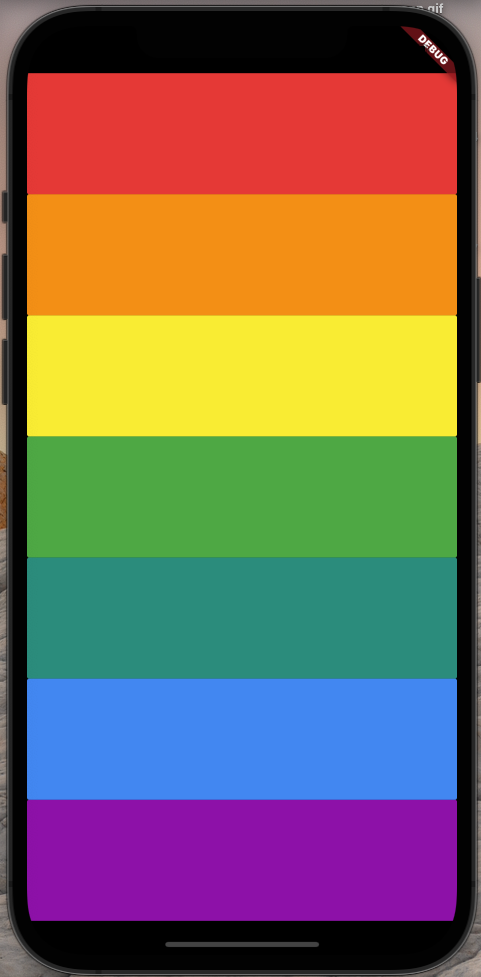

# Xylophone 

## Goal
My version of I am Rich app. A good exercise to how to build an Flutter app. It was one of my firsts Flutter apps.

## The App
An music app that plays Xylophone sounds. Is possible to change the sounds to whatever you whant and create unique musics.

## Features
- Open source libraries for the sound;
- Play sound on both iOS and Android;
- Generate repeated user interface Widgets.
